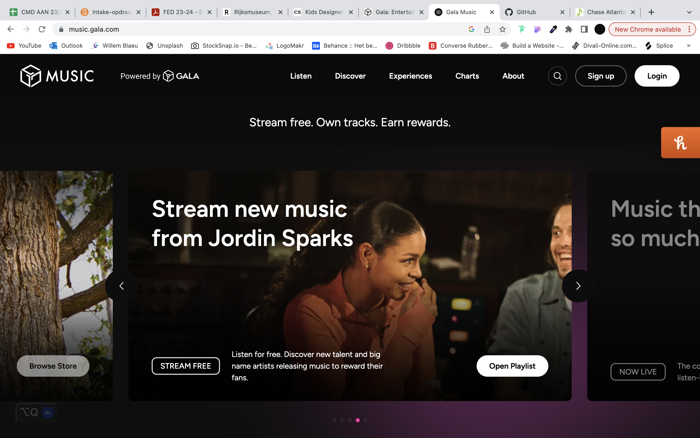
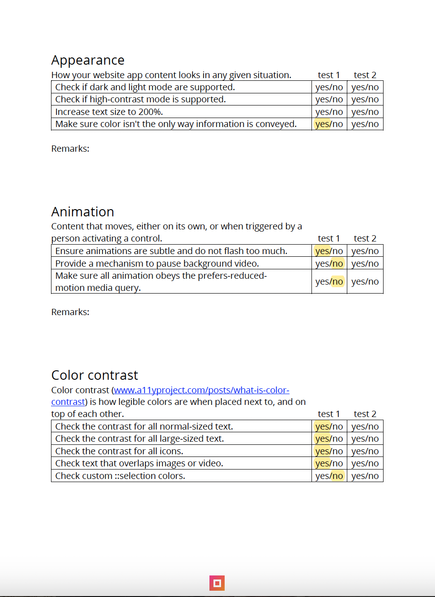

# Procesverslag
Markdown is een simpele manier om HTML te schrijven.  
Markdown cheat cheet: [Hulp bij het schrijven van Markdown](https://github.com/adam-p/markdown-here/wiki/Markdown-Cheatsheet).

Nb. De standaardstructuur en de spartaanse opmaak van de README.md zijn helemaal prima. Het gaat om de inhoud van je procesverslag. Besteedt de tijd voor pracht en praal aan je website.

Nb. Door *open* toe te voegen aan een *details* element kun je deze standaard open zetten. Fijn om dat steeds voor de relevante stuk(ken) te doen.

## Jij

  
uitwerken voor kick-off werkgroep

  ### Auteur:
  Fabio Tran

  #### Je startniveau:
  Rood

  #### Je focus:
  Responsiveness
 

## Je website

  
uitwerken voor kick-off werkgroep

  ### Je opdracht:
  https://music.gala.com/

  #### Screenshot(s) van de eerste pagina (small screen): 
  Homepagina
  

  #### Screenshot(s) van de tweede pagina (small screen):
  Overzichtspagina about
  
 

## Toegankelijkheidstest 1/2 (week 1)

  
uitwerken na test in 2e werkgroep

  ### Bevindingen
  Lijst met je bevindingen die in de test naar voren kwamen:
  - Buttons als iconen hebben geen aria label, zegt alleen 'button'
  - Hij pakt niet alle links? Te diep in div's gegraven misschien?
  - Super veel divs en classes
  - Niet elke link duidelijke beschrijving waar het naartoe gaat, 'coming soon'
  - Javascript infinite scrollers zorgen voor slechte accessibility
  - Alt teksten zijn beknopt
  - H tags zijn duidelijk, maar structuur misschien nog niet helemaal
  - Soms foto's of elementen met lange id, dat wordt helemaal uitgesproken

    
    
    
    
    

## Breakdownschets (week 1)

  
uitwerken na afloop 3e werkgroep

  ### de hele pagina: 
  

  

  ### dynamisch deel (bijv menu): 
  

  ### wellicht nog een dynamisch deel (bijv filter): 
  

## Voortgang 1 (week 2)

  
uitwerken voor 1e voortgang

  ### Stand van zaken
  hier dit ging goed & dit was lastig (neem ook screenshots op van delen van je website en code)

  Voor HTML kon ik keuzes maken welke tags ik gebruik maar was ik af en toe besluiteloos of het de goede tag was in zo'n scenario, deze vraagstukken heb ik meegenomen naar de feedback ronde. Ik had deze week alle HTML al afgerond dus ik kon van alles vragen waar ik gaten in zag qua semantiek, hierdoor hoefde ik voor volgende sessies niet veel op HTML te focussen. Werken met nieuwe formatting van text was lastig, dit werd bepaald door properties zoals width, height en overflow. Ik had een probleem met ellipses toevoegen dus deze nam ik mee naar de feedback

  Wat goed ging was het stijlen verder, dit was in combinatie met een juiste orde van HTMl, daardoor werd het makkelijker om de DOM elementen aan te spreken in css en daar properties te geven. Deze week ben ik nog niet echt begonnen aan variabelen binnen css, ik hoopte eerst kort te kunnen inlopen bij een paar secties en dan later in het proces patronen zien die ik kan omzetten in variabelen. 

  ### Agenda voor meeting
  samen met je groepje opstellen

  | student 1      | student 2          | student 3    | student 4        |
  | ---            | ---                | ---          | ---              |
  | HTML juiste    | en dit             | en ik dit    | en dan ik dat    |
  | semantiek      | dit als er tijd is | nog een punt | dit wil ik zeker |
  | bekijken       | ...                | ...          | ...              |

  ### Verslag van meeting
  hier na afloop snel de uitkomsten van de meeting vastleggen

  - Voor hyperlinks die eruit zien als buttons gewoon a tags gebruiken
  - Buttons zonder context on content erbinnen kunnen hulp gebruiken van aria labels
  - Mijn manier van ul>li structuur gebruiken voor een carousel van kaarten was een correcte manier die ik mocht voortzetten
  - Ellipses hebben we opgelost toe te passen.

## Voortgang 2 (week 3)

  
uitwerken voor 2e voortgang

  ### Stand van zaken
  hier dit ging goed & dit was lastig (neem ook screenshots op van delen van je website en code)

  Deze week meer toegewerkt naar het maken van css en toevoegen van variabelen, dat vond ik soepel verlopen, het toepassen van variabelen en flexbox na een korte opfrisser.

  Ik had deze week ook wat JavaScript toegevoegd aan de code, het is al weer een tijdje dat ik JS heb gebruikt dus dat duurde even wat langer maar uiteindelijk ben ik er toch uitgekomen. Kleinigheidjes tijdens de CSS kwam ook enigszins voor dat wel lastig was. Bijv. als je gebruik maakt van procenten om je referentie parent vast te leggen met een position value. Of het gebruiken van position absoluut om elementen te layeren, zoals tekst over een foto.

  ### Agenda voor meeting
  Ik had al mijn problemen vroegtijdig zelfstandig kunnen oplossen en heb dus niet echt vragen gehad voor de student-assistenten.

  samen met je groepje opstellen

  | student 1      | student 2          | student 3    | student 4        |
  | ---            | ---                | ---          | ---              |
  | dit bespreken  | en dit             | en ik dit    | en dan ik dat    |
  | en dat ook nog | dit als er tijd is | nog een punt | dit wil ik zeker |
  | ...            | ...                | ...          | ...              |

  ### Verslag van meeting
  hier na afloop snel de uitkomsten van de meeting vastleggen

  - punt 1
  - punt 2
  - nog een punt
- ...

## Toegankelijkheidstest 2/2 (week 4)

  
uitwerken na test in 9e werkgroep

  ### Bevindingen
  Lijst met je bevindingen die in de test naar voren kwamen (geef ook aan wat er verbeterd is):
  - Buttons beschrijven veel beter, eerst onduidelijk / helemaal niets
  - Structuur van h'tjes is duidelijker te volgen
  - Divs en classes verminderd, alleen gebruikt met onderbouwing
  - Carousel scrollt mee bij waar je focus is, in de echte website scrollt het niet mee dus zie je niet wat wordt voorgelezen (zit achter horizontal scroll)
  - Alt teksten zijn overal toegevoegd waar nodig
  - Geen onnodig lange id dat wordt uitgesproken door de voice-over
  - Kleine elementen die eerst niet duidelijk waren qua contrast hebben nu beter contrast

    
    
    
    
    

## Voortgang 3 (week 4)

  
uitwerken voor 3e voortgang

  ### Stand van zaken
  hier dit ging goed & dit was lastig (neem ook screenshots op van delen van je website en code)

  Deze week ben ik gaan focussen op zoveel mogelijk responsive maken, voor zover de css af was voor een scherm. Het gebruik van media queries was erg duidelijk en makkelijk toe te passen. Daarentegen, omdat ik mobile-first werkte kom je er later achter dat sommige HTML structuren rondom een desktop structuur is gemaakt, dat zorgde ervoor dat ik tijdens het responsive maken af en toe terug moest naar de HTML en daar de structuur van veranderen. Dat was wel lastig en vervelend aangezien je dan ook weer de css moet gaan aanpassen.

  Voor de rest verliep het wel strak, nadat de HTML en CSS basis goed is is het erg makkelijk om media queries met min-width toe te passen.

  Bij het responsive maken met media queries kom ik erachter dat je goed moet kijken hoe je css in elkaar zit, als je een heel exact pad heb opgesteld en daarna in je media query de style wil overriden voor responsiveness, moet je code gelijk of exacter zijn, als het niet exacter is dan stelt het meer belangstelling op de eerdere code. Of je maakt gebruik van !important

  ### Agenda voor meeting
  samen met je groepje opstellen

  | student 1      | student 2          | student 3    | student 4        |
  | ---            | ---                | ---          | ---              |
  | dit bespreken  | en dit             | en ik dit    | en dan ik dat    |
  | en dat ook nog | dit als er tijd is | nog een punt | dit wil ik zeker |
  | ...            | ...                | ...          | ...              |

  ### Verslag van meeting
  hier na afloop snel de uitkomsten van de meeting vastleggen

  Ik ben zelf best goed in opzoeken en kreeg ook erg goed het gevoel voor html css, ik heb deze week wederom geen vragen voor de student-assistent dus ben zelfstandig gaan voortzetten.

  - punt 1
  - punt 2
  - nog een punt
  - ...

## Eindgesprek (week 5)

  
uitwerken voor eindgesprek

  ### Je uitkomst - karakteristiek screenshots:
  
  

  ### Dit ging goed/Heb ik geleerd: 
  Korte omschrijving met plaatjes

  De css vond ik erg goed gaan uiteindelijk en heb er heel veel van geleerd, ik heb namelijk erg consistent m'n variabelen kunnen gebruiken en dat herhaaldelijk gebruik leid naar een consistente en gebalanceerde layout als website. Bij de css hoort ook een juiste HTMl structuur, als die slordig is moet je erop terugvallen en dan moet je heen en weer html en css aanpassen, ik denk dat ik daar een goede basis in heb gebouwd waardoor ik voor volgende projecten nog sneller te werk kan gaan. De strakke html structuur helpt de screenreader ervaring ook natuurlijk dus dat is dubbel win.

  
  
  

  ### Dit was lastig/Is niet gelukt:
  Het was lastig om een infinite carousel te maken, dan zou je de DOM elementen moeten slicen en dupliceren naar de andere kant, het creëert eigenlijk clones die niet directe HTML elementen zijn en dat vond ik daarbovenop dus ook niet juist qua toegankelijkheid, ik heb dat achtergelaten.

  Ik vond het lastig om goed rekening te kunnen houden qua toegankelijkheid, dat kwam mede deels omdat ik niet zo een soepele flow heb met voice readers dan mensen die dit oprecht gebruiken, de manier hoe ik en m'n testgenoot navigeer kan variëren t.o.v. iemand die dit dagelijks gebruikt. Ik heb een gevoel dat ik een goed resultaat heb bereikt qua toegankelijkheid en semantiek dergelijke op basis van m'n testen en wat ik zelf duidelijk vind, maar ik zou pas echt weten wat er goed en fout gaat als ik nog een perspectief had van iemand die hier gebruik van maakt.

  

## Bronnenlijst

  
continu bijhouden terwijl je werkt

  Nb. Wees specifiek ('css-tricks' als bron is bijv. niet specifiek genoeg). 
  Nb. ChatGpT en andere AI horen er ook bij.
  Nb. Vermeld de bronnen ook in je code.

https://www.youtube.com/watch?v=aAWwCuWWwwA
https://developer.mozilla.org/en-US/docs/Web/CSS/text-overflow
https://youtu.be/yU7jJ3NbPdA?si=gmUF4v0d9IHSgx-U
https://developer.mozilla.org/en-US/docs/Web/HTML/Element/video
https://developer.mozilla.org/en-US/docs/Web/CSS/CSS_grid_layout/Box_alignment_in_grid_layout
https://developer.mozilla.org/en-US/docs/Web/API/Window/scrollTo
https://developer.mozilla.org/en-US/docs/Web/API/Element/scrollLeft
https://www.youtube.com/watch?v=4UXJb4rjeDg&t=147s
https://codepen.io/JTBennett/pen/obZgXP
https://www.youtube.com/watch?v=fYq5PXgSsbE
https://developer.mozilla.org/en-US/docs/Web/CSS/scroll-behavior
https://developer.mozilla.org/en-US/docs/Web/CSS/scroll-snap-type
https://developer.mozilla.org/en-US/docs/Web/CSS/scroll-snap-align
https://developer.mozilla.org/en-US/docs/Web/CSS/scrollbar-width
https://gomakethings.com/converting-a-nodelist-to-an-array-with-vanilla-javascript/
https://developer.mozilla.org/en-US/docs/Web/CSS/important
https://youtu.be/fYq5PXgSsbE?si=NiXKV0ZPyabW39qB
https://youtu.be/yU7jJ3NbPdA?si=L_NQ0yACqAWY3eb0
https://kinsta.com/blog/responsive-web-design/
https://youtu.be/Mvu5OMGcdVA?si=flusbNH8Y0l0mCX1

